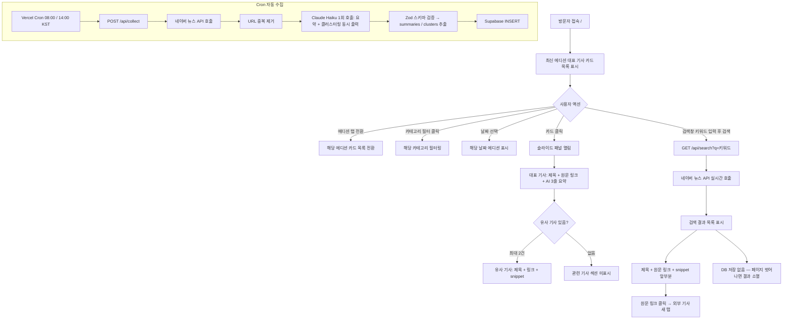

# 보험 뉴스 대시보드 웹 개발 설계서

> **기술 스택**: Next.js 15 (App Router) · TweakCN · Supabase  
> **에이전트 구조**: 단일 에이전트 (CLAUDE.md)  
> **작성 목적**: Claude Code 구현 참조용 계획서  
> **v1.0 범위**: 뉴스 수집·요약·표시 + 사용자 검색 (이메일 구독 기능은 v2.0으로 이월)

---

## 1. 프로젝트 컨텍스트

### 목적
보험/보험상품 관련 뉴스를 네이버 뉴스 API로 자동 수집·요약하여 카드형 웹페이지로 제공하고, 사용자가 필요할 때 직접 키워드로 검색할 수 있는 서비스.

### 대상 사용자
- **주요**: 보험업 종사자(설계사, 언더라이터, 상품개발팀), 보험 관련 연구자·학생
- **부차**: 보험 가입을 고려 중인 일반 소비자

### 핵심 기능 요약 (v1.0)
1. 네이버 뉴스 API로 하루 2회(08:00 / 14:00 KST) 자동 수집
2. **정기 수집 기사**: Claude API(Haiku)로 3줄 AI 요약 + 카테고리 분류 + 유사 기사 클러스터링
3. **사용자 검색 기사**: AI 요약 없이 기사 앞부분(snippet) 그대로 표시 + 제목·링크 제공
4. 카드형 UI — 에디션 탭, 카테고리 필터, 날짜 선택
5. 사용자 직접 검색 — 키워드 입력 시 네이버 뉴스 API 실시간 호출, 결과 일시 표시 (DB 미저장)
6. 카드 클릭 시 슬라이드 패널 — 기사 상세 + 유사 기사 최대 2건 (정기 수집 기사만)

### 기능 범위 비교표

| 기능 | 정기 수집 기사 (Cron) | 사용자 검색 기사 |
|------|----------------------|-----------------|
| 수집 방식 | Vercel Cron 자동 실행 | 사용자 키워드 입력 시 실시간 |
| DB 저장 | ✅ Supabase 영구 저장 | ❌ 미저장 (세션 내 일시 표시) |
| AI 요약 | ✅ Claude Haiku 3줄 요약 | ❌ 네이버 API snippet 앞부분 표시 |
| 클러스터링 | ✅ 유사 기사 묶음 처리 | ❌ 없음 (개별 결과 나열) |
| 슬라이드 패널 | ✅ 상세 패널 (요약 + 유사 기사) | ❌ 없음 (제목 + 링크 + snippet만) |
| 이메일 발송 | ❌ v2.0 이월 | ❌ v2.0 이월 |

### 제약 조건
| 항목 | 내용 |
|------|------|
| 인증 | 불필요 (공개 접근) |
| 성능 | 메인 페이지 LCP ≤ 2.5s, 사용자 검색 응답 ≤ 1s |
| 비용 | Claude Haiku — 정기 수집 기사만 호출 (사용자 검색 시 미호출로 비용 절감) |
| 데이터 소스 | 네이버 뉴스 검색 API (일 25,000건 무료) |
| 배포 | Vercel (**Pro 플랜**, Cron 빈도 제한 없음) |

### 용어 정의
| 용어 | 설명 |
|------|------|
| **에디션(edition)** | 특정 수집 시점의 묶음. `'08:00'`, `'14:00'` 두 가지 |
| **edition_date** | 에디션 발간 날짜 (KST 기준) |
| **카테고리** | `생명보험` / `손해보험` / `제도·규제` / `상품` / `기타` |
| **클러스터(cluster)** | 동일 주제로 묶인 기사 그룹. 대표 기사 1건 + 유사 기사 최대 2건 |
| **대표 기사** | 클러스터 내 가장 정보량이 많거나 신뢰도 높은 출처의 기사 |
| **유사 기사** | 대표 기사와 주제·내용이 80% 이상 겹치는 기사. 클러스터당 최대 2건 표시 |
| **snippet** | 네이버 뉴스 API가 반환하는 기사 앞부분 요약 텍스트 (AI 미가공) |

---

## 2. 페이지 목록 및 사용자 흐름

### 페이지 목록
| 경로 | 페이지명 | 설명 | 인증 필요 |
|------|----------|------|-----------|
| `/` | 메인 대시보드 | 에디션 카드 그리드 + 사용자 검색 영역 | 불필요 |
| `/api/collect` | 수집 API | Cron 자동 트리거 엔드포인트 | `CRON_SECRET` 헤더 |
| `/api/news` | 저장 뉴스 조회 API | 정기 수집 기사 목록 조회 (필터 포함) | 불필요 |
| `/api/search` | 실시간 검색 API | 네이버 뉴스 API 프록시 (DB 미저장) | 불필요 |

> **별도 상세 페이지 없음** — 정기 수집 기사 상세는 메인 페이지 내 슬라이드 패널(Sheet)로 처리

### 화면 구성 개요

```
┌──────────────────────────────────────────────────────┐
│  🏠 보험 뉴스 대시보드                  [날짜 선택]  │  ← 헤더
├──────────────────────────────────────────────────────┤
│  [ 08:00 에디션 ]  [ 14:00 에디션 ]                  │  ← 에디션 탭
│  [전체] [생명보험] [손해보험] [제도·규제] [상품]      │  ← 카테고리 필터
├──────────────────────────────────────────────────────┤
│                                                      │
│  ┌──────────┐  ┌──────────┐  ┌──────────┐           │
│  │ 기사 카드 │  │ 기사 카드 │  │ 기사 카드 │           │  ← 정기 수집 카드 그리드
│  │ AI 요약  │  │ AI 요약  │  │ AI 요약  │           │     (AI 요약 포함)
│  │[관련 2건]│  └──────────┘  └──────────┘           │
│  └──────────┘                                        │
│                                                      │
├──────────────────────────────────────────────────────┤
│  ┌──────────────────────────────────────────────┐   │
│  │  🔍  보험 뉴스 직접 검색                      │   │  ← 사용자 검색 영역
│  │  [ 키워드 입력 ]              [검색]          │   │
│  └──────────────────────────────────────────────┘   │
│                                                      │
│  검색 결과 (제목 + 링크 + snippet)                   │
│  · 기사 제목 1  🔗                                  │
│    snippet 앞부분 2~3줄...                           │
│  · 기사 제목 2  🔗                                  │
│    snippet 앞부분 2~3줄...                           │
│                                                      │
└──────────────────────────────────────────────────────┘
```

### 사용자 흐름 다이어그램



### 슬라이드 패널 레이아웃 (정기 수집 기사 전용)

```
┌─────────────────────────────────────┐
│  [×] 닫기                           │
│                                     │
│  [카테고리 배지]  [출처]  [발행시각] │
│                                     │
│  ## 대표 기사 제목                   │
│  🔗 원문 보기 →  (새 탭)            │
│                                     │
│  ─── AI 요약 ──────────────────── │
│  · 요약 1줄                         │
│  · 요약 2줄                         │
│  · 요약 3줄                         │
│                                     │
│  ─── 관련 기사 ─────────────────── │  ← 유사 기사 있을 때만
│                                     │
│  📄 유사 기사 제목 1                 │
│     출처 · 발행시각                  │
│     🔗 원문 보기 →                  │
│     snippet 앞부분 (AI 미가공)       │
│                                     │
│  📄 유사 기사 제목 2                 │
│     출처 · 발행시각                  │
│     🔗 원문 보기 →                  │
│     snippet 앞부분 (AI 미가공)       │
└─────────────────────────────────────┘
```

### 데이터 흐름

```
━━━━━━━━━━━━━━━━━━━━━━━━━━━━━━━━━━━━━━━
[경로 A] 정기 수집 (Cron)
━━━━━━━━━━━━━━━━━━━━━━━━━━━━━━━━━━━━━━━
Vercel Cron (08:00 / 14:00 KST)
  → POST /api/collect
    1. 네이버 뉴스 검색 API 호출
       키워드: ["보험", "보험료", "보험상품", "금감원 보험"]
    2. URL 기준 중복 제거 (DB UNIQUE 체크)
    3. Claude Haiku 1회 호출 (Structured Output)
       → summaries[]: { id, summary(3줄), summary_short, category }
       → clusters[]:  { representative_id, similar_ids[] }
    5. Supabase ins_news_articles INSERT
       · 대표 기사: is_representative=true, cluster_id=자기id
       · 유사 기사: is_representative=false, cluster_id=대표id
    6. edition / edition_date 태깅
  → Supabase 영구 저장
  → GET /api/news 로 클라이언트에 서빙

━━━━━━━━━━━━━━━━━━━━━━━━━━━━━━━━━━━━━━━
[경로 B] 사용자 직접 검색 (실시간)
━━━━━━━━━━━━━━━━━━━━━━━━━━━━━━━━━━━━━━━
사용자 키워드 입력 → 검색 버튼 클릭
  → GET /api/search?q={keyword}
    1. 네이버 뉴스 검색 API 실시간 호출
    2. 응답 그대로 클라이언트 전달
       (AI 가공 없음, DB 저장 없음)
  → 클라이언트: 제목 + 링크 + snippet 리스트 표시
  → 페이지 이동/새로고침 시 결과 소멸
```

### LLM 판단 vs 코드 처리 구분
| Claude Code 에이전트가 판단 | 스크립트·코드로 처리 |
|-----------------------------|----------------------|
| 컴포넌트 구조 및 재사용성 설계 | Supabase 마이그레이션 SQL 실행 |
| 카드 UI 레이아웃 및 필터 UX | 네이버 뉴스 API fetch 파싱 |
| 카테고리 분류 + 클러스터링 프롬프트 설계 | URL 중복 제거 알고리즘 |
| 정기 수집 vs 검색 결과 UI 차별화 방향 | /api/search 프록시 구현 |
| 슬라이드 패널 UX 흐름 설계 | vercel.json cron 설정 |
| TweakCN 컴포넌트 커스터마이징 방향 | snippet 앞부분 자르기 유틸 |

---

## 3. 데이터 모델 (Supabase)

### 테이블 목록
| 테이블명 | 설명 | RLS | 비고 |
|----------|------|-----|------|
| `ins_news_articles` | 정기 수집 기사 (클러스터 관계 포함) | ✅ (읽기 공개) | 사용자 검색 결과는 미저장 |

> **테이블 prefix**: `ins_` — 기존 Supabase 프로젝트 테이블과 충돌 방지  
> **이메일 구독 테이블 (`ins_subscribers`)**: v2.0에서 추가 예정

### ins_news_articles 스키마
```sql
id                uuid    PRIMARY KEY DEFAULT gen_random_uuid()
title             text    NOT NULL
url               text    UNIQUE NOT NULL      -- originallink 우선, 없으면 link 폴백 (중복 방지 핵심 제약)
naver_link        text                         -- 네이버 뉴스 URL 보조 저장 (link 필드)
summary           text                         -- Claude Haiku 3줄 요약 (대표 기사)
summary_short     text                         -- 유사 기사 패널 내 1~2줄 축약
snippet           text                         -- 네이버 API 원본 snippet (AI 미가공)
source            text                         -- 출처명 (e.g. '연합뉴스', '한국경제')
published_at      timestamptz
category          text                         -- 생명보험 / 손해보험 / 제도·규제 / 상품 / 기타
edition           text                         -- '08:00' | '14:00'
edition_date      date                         -- KST 발간 날짜
cluster_id        uuid    REFERENCES ins_news_articles(id) ON DELETE CASCADE  -- 자기 참조
is_representative boolean DEFAULT true         -- true=대표 기사, false=유사 기사
collected_at      timestamptz DEFAULT now()
```

> **클러스터링 설계 원칙**
> - 대표 기사: `cluster_id = 자기 id`, `is_representative = true`
> - 유사 기사: `cluster_id = 대표 기사 id`, `is_representative = false`
> - 단독 기사(유사 없음): 대표 기사와 동일 처리
> - DB에는 유사 기사 제한 없이 저장, **API 조회 시 최대 2건만 반환**

### 주요 인덱스
```sql
-- 최신 에디션 조회
CREATE INDEX idx_ins_articles_edition
  ON ins_news_articles (edition_date DESC, edition);

-- 카테고리 필터
CREATE INDEX idx_ins_articles_category
  ON ins_news_articles (category);

-- 대표 기사 목록 조회
CREATE INDEX idx_ins_articles_representative
  ON ins_news_articles (is_representative, edition_date DESC);

-- 유사 기사 조회
CREATE INDEX idx_ins_articles_cluster
  ON ins_news_articles (cluster_id)
  WHERE is_representative = false;
```

### /api/news 조회 쿼리 패턴

> **조회 방식**: Supabase `.rpc()`로 PostgreSQL 함수 호출 — LATERAL JOIN을 DB 함수 내에 캡슐화하여 클라이언트 코드 단순화

```sql
-- PostgreSQL 함수 (supabase/migrations에 포함)
CREATE OR REPLACE FUNCTION get_edition_articles(
  p_edition_date date,
  p_edition      text,
  p_category     text DEFAULT NULL
)
RETURNS TABLE (...) AS $$
  -- 대표 기사 + 유사 기사 최대 2건 포함
  SELECT
    a.*,
    json_agg(s.*) FILTER (WHERE s.id IS NOT NULL) AS similar_articles
  FROM ins_news_articles a
  LEFT JOIN LATERAL (
    SELECT id, title, url, naver_link, source, published_at, snippet, summary_short
    FROM ins_news_articles
    WHERE cluster_id = a.id
      AND is_representative = false
    ORDER BY collected_at ASC
    LIMIT 2
  ) s ON true
  WHERE a.is_representative = true
    AND a.edition_date = p_edition_date
    AND a.edition = p_edition
    AND (p_category IS NULL OR a.category = p_category)
  ORDER BY a.published_at DESC
  LIMIT 20;
$$ LANGUAGE sql STABLE;
```

```typescript
// /api/news/route.ts 에서 호출
const { data } = await supabase.rpc('get_edition_articles', {
  p_edition_date: editionDate,
  p_edition: edition,
  p_category: category ?? null,
})
```

### /api/search 응답 구조 (DB 미사용, 네이버 API 프록시)
```typescript
// 네이버 뉴스 API 응답을 그대로 변환
interface SearchResult {
  title: string        // HTML 태그 제거 후 반환 (/<[^>]+>/g + he.decode())
  link: string         // 원문 URL
  snippet: string      // description sanitize 후 앞 100자 내외로 잘라서 반환
  pubDate: string      // 발행일 (new Date(pubDate).toISOString() 변환)
  originallink: string // 원본 기사 URL (네이버 뉴스 URL과 별개)
}
```

### RLS 정책 요약
```
ins_news_articles:
  SELECT: 모든 사용자 허용 (공개)
  INSERT/UPDATE/DELETE: service_role 키만 허용
```

---

## 4. UI/UX 방향

### 디자인 톤
**다크 테크 + 에디토리얼** — 금융·보험 정보의 신뢰성과 가독성을 우선시하되, 딱딱하지 않은 뉴스레터 감성을 더함.

- 배경: 짙은 네이비 (`#0A0F1E`)
- 카드: 반투명 백드롭 블러 + 얇은 테두리 (glassmorphism 절제된 버전)
- 강조색: 앰버 (`#F59E0B`) — 카테고리 배지, CTA 버튼
- 본문 폰트: `Noto Sans KR` (한국어 가독성 최우선)
- 헤딩 폰트: `Bebas Neue` 또는 `DM Serif Display` (에디토리얼 느낌)

### 컬러 토큰
```css
--background:   #0A0F1E
--surface:      #131929
--surface-alt:  #1C2438
--border:       rgba(255,255,255,0.08)
--primary:      #F59E0B   /* 앰버 */
--primary-fg:   #0A0F1E
--text:         #E2E8F0
--text-muted:   #64748B
--accent:       #38BDF8   /* 스카이블루 — 링크, 호버 */
--search-bg:    #0F1728   /* 검색 영역 구분 배경 */
```

### 핵심 컴포넌트 목록

**정기 수집 영역**
| 컴포넌트 | 역할 |
|----------|------|
| `NewsCard` | 대표 기사 카드 — 제목·출처·시각·AI 요약 미리보기·유사 기사 수 배지 |
| `ArticlePanel` | 슬라이드 패널(Sheet) — 대표 기사 상세 + 유사 기사 목록 |
| `SimilarArticleItem` | 유사 기사 1건 — 제목·출처·링크·snippet |
| `EditionTabs` | 08:00 / 14:00 에디션 탭 전환 |
| `CategoryFilter` | 카테고리 탭 바 |
| `DatePicker` | 에디션 날짜 선택 |
| `SimilarCountBadge` | 카드에 "관련 N건" 표시 (유사 기사 있을 때만) |

**사용자 검색 영역**
| 컴포넌트 | 역할 |
|----------|------|
| `SearchSection` | 검색창 + 검색 버튼 래퍼 (시각적으로 구분된 영역) |
| `SearchResultItem` | 검색 결과 1건 — 제목·링크·snippet (AI 요약 없음) |
| `SearchResultList` | 검색 결과 목록 |
| `SearchEmptyState` | 검색 결과 없음 표시 |

**공통**
| 컴포넌트 | 역할 |
|----------|------|
| `LoadingSkeleton` | 카드 로딩 중 스켈레톤 UI |
| `EmptyState` | 에디션 기사 없을 때 표시 |

### 정기 수집 카드 vs 검색 결과 시각적 차별화

| 항목 | 정기 수집 카드 | 검색 결과 아이템 |
|------|--------------|----------------|
| 레이아웃 | 카드형 (border, 배경, padding) | 리스트형 (구분선만, 카드 없음) |
| 요약 표시 | AI 요약 3줄 (라벨: "AI 요약") | snippet 앞부분 (라벨 없음) |
| 클릭 동작 | 슬라이드 패널 오픈 | 원문 링크로 바로 이동 (새 탭) |
| 배지 | 카테고리 + 에디션 배지 | 없음 |
| 관련 기사 | 유사 기사 N건 배지 | 없음 |

### TweakCN 커스터마이징

> **활용 방법**: `tweakcn.com` 테마 생성기에서 CSS 변수 생성 → `globals.css`에 붙여넣기
> 컴포넌트는 shadcn/ui 그대로 사용, 아래 컬러 토큰을 기반으로 tweakcn에서 테마를 생성해 적용

#### 커스터마이징 대상
| 컴포넌트 | 변경 방향 |
|----------|-----------|
| `Card` | 배경 `--surface`, 테두리 `--border`, hover border-color `--accent`, cursor pointer |
| `Sheet` | 우측 슬라이드, 너비 480px (md↑), 배경 `--surface`, 오버레이 backdrop-blur |
| `Tabs` (에디션) | pill 형태, 활성 탭 `--primary` 배경 |
| `Tabs` (카테고리) | 하단 라인 강조, 비활성 `--text-muted` |
| `Badge` | 카테고리별 색상 (생명=앰버, 손해=스카이, 규제=로즈, 상품=에메랄드) |
| `Button` | `--primary` 배경, `rounded-sm`, font-weight 600 |
| `Input` | 배경 `--surface-alt`, 포커스 ring `--accent` |
| `Separator` | 검색 결과 구분선, `--border` 색상 |
| `Skeleton` | `--surface-alt` 기준 shimmer 애니메이션 |

### 반응형 브레이크포인트
| 브레이크포인트 | 카드 컬럼 수 | 슬라이드 패널 |
|---------------|-------------|-------------|
| `< 640px` (sm) | 1열 | 전체 화면 (bottom sheet, `side="bottom"`, `max-h-[90vh] overflow-y-auto`) |
| `640~1024px` (md) | 2열 | 360px 우측 슬라이드 |
| `> 1024px` (lg) | 3열 | 480px 우측 슬라이드 |
| `> 1280px` (xl) | 4열 | 480px 우측 슬라이드 |

### 애니메이션·인터랙션 방향
- 카드 진입: `fade-in + translateY(8px)` 스태거 (0.05s 간격)
- 카드 호버: `border-color` 전환 + `scale(1.01)`
- 슬라이드 패널: TweakCN `Sheet` slide-in 애니메이션
- 유사 기사: 패널 내 `fade-in` (0.1s delay)
- 에디션 탭 전환: 카드 그리드 `opacity` 페이드 (0.15s)
- 검색 결과: 리스트 `fade-in` (결과 도착 후)
- 검색 버튼: 로딩 중 스피너 + 비활성화

---

## 5. 구현 스펙

### 폴더 구조
```
/insurance-news-dashboard
  ├── CLAUDE.md                              # 메인 에이전트 지침
  ├── .claude/
  │   └── skills/
  │       ├── news-collector/
  │       │   ├── SKILL.md
  │       │   ├── scripts/
  │       │   │   └── fetch-naver.ts         # 네이버 뉴스 API 호출
  │       │   └── references/
  │       │       └── naver-api-guide.md
  │       └── ai-summarizer/
  │           ├── SKILL.md
  │           └── scripts/
  │               ├── summarize-batch.ts     # Claude Haiku 배치 요약
  │               └── cluster-batch.ts       # Claude Haiku 클러스터링
  ├── app/
  │   ├── layout.tsx                         # 루트 레이아웃 (폰트, 메타)
  │   ├── page.tsx                           # 메인 대시보드
  │   ├── globals.css                        # CSS 변수, TweakCN 토큰
  │   └── api/
  │       ├── collect/
  │       │   └── route.ts                   # POST — Cron 자동 수집
  │       ├── news/
  │       │   └── route.ts                   # GET — 저장 기사 조회
  │       └── search/
  │           └── route.ts                   # GET — 실시간 검색 프록시
  ├── components/
  │   ├── ui/                                # TweakCN 기본 컴포넌트
  │   ├── news/
  │   │   ├── NewsCard.tsx
  │   │   ├── NewsGrid.tsx
  │   │   ├── ArticlePanel.tsx               # 슬라이드 패널
  │   │   ├── SimilarArticleItem.tsx
  │   │   ├── EditionTabs.tsx
  │   │   ├── CategoryFilter.tsx
  │   │   ├── DatePicker.tsx
  │   │   ├── SimilarCountBadge.tsx
  │   │   ├── LoadingSkeleton.tsx
  │   │   └── EmptyState.tsx
  │   └── search/
  │       ├── SearchSection.tsx              # 검색창 + 버튼 래퍼
  │       ├── SearchResultList.tsx
  │       ├── SearchResultItem.tsx
  │       └── SearchEmptyState.tsx
  ├── lib/
  │   ├── supabase/
  │   │   ├── client.ts
  │   │   ├── server.ts
  │   │   └── queries.ts
  │   ├── collectors/
  │   │   └── naver.ts                       # 네이버 API 호출 함수
  │   ├── summarizer.ts                      # Claude Haiku 요약
  │   ├── clusterer.ts                       # Claude Haiku 클러스터링
  │   ├── deduplicator.ts                    # URL 중복 제거
  │   └── utils/
  │       ├── date-kst.ts                    # KST 날짜 변환
  │       └── snippet.ts                     # snippet 앞부분 자르기 유틸
  ├── types/
  │   └── index.ts                           # NewsArticle, SearchResult 타입
  ├── supabase/
  │   └── migrations/
  │       └── 001_initial_schema.sql
  ├── docs/
  │   └── domain/
  │       └── schema.md
  ├── vercel.json
  └── .env.local.example
```

### 에이전트 구조

**단일 에이전트 (CLAUDE.md)**

CLAUDE.md 핵심 섹션 목록 (구현 시 작성):
1. 프로젝트 개요 및 v1.0 범위 (이메일 기능 제외 명시)
2. 기술 스택 버전 (Next.js 15, Supabase JS v2)
3. 두 가지 뉴스 흐름 구분 (정기 수집 vs 사용자 검색)
4. 구현 순서 (5단계 빌드 시퀀스)
5. 코딩 컨벤션
6. 스킬 참조 방법
7. 환경 변수 목록
8. 성공 기준 체크리스트

### 스킬 목록
| 스킬명 | 역할 | 트리거 조건 |
|--------|------|------------|
| `news-collector` | 네이버 뉴스 API fetch 및 응답 파싱 | `/api/collect`, `/api/search` 구현 또는 수정 시 |
| `ai-summarizer` | Claude Haiku 배치 요약 + 카테고리 + 클러스터링 | 요약·클러스터링 로직 구현 또는 프롬프트 튜닝 시 |

### Claude Haiku AI 처리 전략 (요약 + 클러스터링)

> **호출 방식**: **1회 호출**로 `summaries` 배열 + `clusters` 배열 병렬 출력
> **출력 제약**: **Structured Output (JSON Schema)** 사용 — 파싱 실패 없음
> **요약 포맷**: 글머리(•) 3개, 줄당 한국어 40~60자
> **클러스터링 폴백**: JSON 파싱 실패 시 에디션 전체 기사를 단독 대표 기사로 처리

**입력:**
```json
[{ "id": "uuid", "title": "...", "source": "...", "snippet": "..." }, ...]
```

**출력 JSON Schema (Structured Output):**
```json
{
  "summaries": [
    {
      "id": "uuid",
      "summary": "• 요약1 (40~60자)\n• 요약2 (40~60자)\n• 요약3 (40~60자)",
      "summary_short": "• 축약 1~2줄",
      "category": "생명보험|손해보험|제도·규제|상품|기타"
    }
  ],
  "clusters": [
    {
      "representative_id": "uuid-A",
      "similar_ids": ["uuid-B", "uuid-C"]
    }
  ]
}
```

**클러스터링 판단 기준:**
- 제목 + snippet 기준 주제 유사도 80% 이상 → 같은 클러스터
- 동일 법령 개정, 동일 사건의 다른 매체 보도 → 유사로 판단
- 대표 기사 우선순위: 신뢰도 높은 출처 → 정보량 → 수집 순서
- 모든 기사는 반드시 하나의 클러스터에 속해야 함 (similar_ids=[] 허용)

### 5단계 빌드 시퀀스

| 단계 | 내용 | 성공 기준 | 검증 방법 | 실패 처리 |
|------|------|-----------|-----------|-----------|
| **Step 1** | 프로젝트 초기화 + Supabase 스키마 | 마이그레이션 오류 0건, TypeScript 타입 생성 성공 | 타입/스키마 검증 | 자동 재시도 (SQL 수정) |
| **Step 2** | 네이버 API 수집 엔진 (`/api/collect`) | 기사 파싱 성공, DB INSERT 확인 | 규칙 기반 (응답 건수 > 0) | 자동 재시도 (최대 3회) |
| **Step 3** | Claude Haiku 요약 + 클러스터링 (Structured Output + Zod 검증) | 요약 생성, 클러스터 관계 DB 저장 확인 | LLM 자기 검증 (Zod 스키마 파싱 결과 확인) | 폴백: Zod 파싱 실패 시 전체 단독 대표 기사 처리 |
| **Step 4** | 프론트엔드 카드 UI + 슬라이드 패널 | 빌드 오류 0, 패널 동작 확인 | 규칙 기반 + 사람 검토 | 에스컬레이션 |
| **Step 5** | 사용자 검색 기능 (`/api/search` + UI) | 키워드 입력 → 결과 목록 표시 확인 | 규칙 기반 + 사람 검토 | 자동 재시도 |

### 환경 변수
| 변수명 | 용도 |
|--------|------|
| `NEXT_PUBLIC_SUPABASE_URL` | Supabase 프로젝트 URL |
| `NEXT_PUBLIC_SUPABASE_ANON_KEY` | Supabase 공개 키 (브라우저용) |
| `SUPABASE_SERVICE_ROLE_KEY` | Supabase 서비스 키 (서버 전용) |
| `NAVER_CLIENT_ID` | 네이버 뉴스 검색 API 클라이언트 ID |
| `NAVER_CLIENT_SECRET` | 네이버 뉴스 검색 API 시크릿 |
| `ANTHROPIC_API_KEY` | Claude Haiku 요약·클러스터링 API 키 |
| `CRON_SECRET` | Cron 엔드포인트 무단 호출 방지 토큰 (Vercel 자동 주입 `authorization: Bearer` 헤더 검증) |
| `COLLECT_KEYWORDS` | 쉼표 구분 수집 키워드 목록 (초기값: `보험,보험료,보험상품,금감원 보험`) |

### vercel.json Cron 설정
```json
{
  "crons": [
    { "path": "/api/collect?edition=0800", "schedule": "0 23 * * *" },
    { "path": "/api/collect?edition=1400", "schedule": "0 5 * * *"  }
  ]
}
```
> UTC 기준: 23:00 UTC = 08:00 KST, 05:00 UTC = 14:00 KST
> `edition` 파라미터: `0800` / `1400` (콜론 제거) → 서버에서 `'08:00'` / `'14:00'` 매핑

### 결정된 구현 세부사항

> 인터뷰를 통해 확정된 항목들. 구현 시 이 섹션을 우선 참조.

#### 데이터 수집 레이어
| 항목 | 결정 |
|------|------|
| URL UNIQUE 키 | `originallink` 우선, 없으면 `link` 폴백 → 컬럼명 `url`에 저장 |
| 에디션당 수집량 | 키워드당 10건, 총 최대 40건 |
| 중복제거 타이밍 | 네이버 API 호출 직후 → Supabase 배치 조회로 신규 URL만 Haiku에 전달 |
| 수집 키워드 관리 | `COLLECT_KEYWORDS` 환경변수로 관리 |
| HTML 정제 | 서버 레이어에서 `/<[^>]+>/g` 정규식 + `he.decode()` 적용 |
| `pubDate` 파싱 | `new Date(pubDate).toISOString()` |

#### Haiku AI 처리
| 항목 | 결정 |
|------|------|
| 호출 방식 | 1회 호출로 summaries + clusters 병렬 출력 |
| 출력 제약 | Structured Output (JSON Schema) |
| 요약 포맷 | 글머리(•) 3개, 줄당 한국어 40~60자 |
| 요약 실패 폴백 | `summary=null` 저장, 클라이언트에서 snippet 표시 + '요약 준비 중' 라벨 |
| 클러스터링 실패 폴백 | 에디션 전체 기사를 단독 대표 기사로 처리 |
| 카테고리 오분류 | v1은 허용, v2에서 관리자 UI 추가 |

#### 프론트엔드 / 데이터 페칭
| 항목 | 결정 |
|------|------|
| 메인 페이지 렌더링 | Next.js ISR, `revalidate: 300` (5분), 오늘 날짜 최신 에디션만 사전 렌더링 |
| 에디션/카테고리 필터링 | 클라이언트 사이드 (useState) |
| 기본 선택 | 오늘 날짜 + 최신 에디션 (14:00 있으면 14:00, 없으면 08:00) |
| 과거 날짜 선택 시 | 클라이언트에서 `/api/news?date=...` 직접 요청 |
| `/api/news` 응답 캐싱 | `Cache-Control: s-maxage=300, stale-while-revalidate` |
| DatePicker 범위 | 최근 30일로 제한 |
| 14:00 탭 데이터 없을 때 | 탭 비활성화 (disabled) |
| 페이지네이션 | 없음 — 클러스터 기준 에디션당 최대 20건 이하로 충분 |
| KST 날짜 변환 | `Intl.DateTimeFormat('ko-KR', { timeZone: 'Asia/Seoul' })` |

#### 검색
| 항목 | 결정 |
|------|------|
| 검색창 위치 | 카드 그리드 아래 (에디션이 주 기능, 검색 부차적) |
| 검색 타임아웃 | 클라이언트 요청~수신 기준 1초, AbortController 적용 |

---

## 6. 워크플로우 — 실패 처리 상세

### /api/collect 실패 시나리오
| 시나리오 | 처리 방식 |
|----------|-----------|
| 네이버 API 429 (Rate Limit) | 지수 백오프 재시도 (1s → 2s → 4s, 최대 3회) |
| Claude API 요약 타임아웃 | summary=null 저장, 카드에 snippet 표시로 폴백 |
| Claude API 클러스터링 실패 | 에디션 전체 기사를 단독 대표 기사 처리 후 계속 |
| Supabase INSERT 실패 (중복) | UPSERT DO NOTHING, 무시 후 계속 |
| Cron 전체 실패 | Vercel 로그 확인 후 수동 /api/collect 호출로 보완 |

### /api/search 실패 시나리오
| 시나리오 | 처리 방식 |
|----------|-----------|
| 네이버 API 오류 | 에러 메시지 클라이언트 반환, SearchEmptyState 표시 |
| 빈 키워드 입력 | 클라이언트 측 유효성 검사로 API 호출 차단 |
| 타임아웃 (1s 초과) | 로딩 취소 + "검색에 실패했습니다" 토스트 |

### 프론트엔드 에러 처리
| 상황 | 폴백 UI |
|------|---------|
| summary 없는 정기 수집 기사 | AI 요약 대신 snippet 표시 + "(요약 준비 중)" 라벨 |
| 유사 기사 0건 | 슬라이드 패널 "관련 기사" 섹션 미표시 |
| 에디션 기사 0건 | EmptyState — "해당 에디션 기사가 없습니다" |
| 검색 결과 0건 | SearchEmptyState — "검색 결과가 없습니다" |
| API 오류 | 토스트 알림 + 기존 화면 유지 |

---

## 7. v2.0 이월 기능

다음 기능은 v1.0 범위에서 제외되며, v2.0에서 구현 예정:

| 기능 | 비고 |
|------|------|
| 이메일 구독 및 발송 (Resend) | `ins_subscribers` 테이블 스키마는 v2.0 마이그레이션으로 추가 |
| Google News RSS / 금감원 공시 수집 | v1.0은 네이버 뉴스 API 단일 소스 |
| 관리자 페이지 | 수동 수집 트리거, 구독자 관리 |
| 검색 기록 저장 | 인기 검색어, 검색 히스토리 |

---

## 8. 참고 자료

### API 문서
- [네이버 뉴스 검색 API](https://developers.naver.com/docs/serviceapi/search/news/v1/news.md) — 일 25,000건 무료
- [Anthropic Claude API](https://docs.anthropic.com/en/api/messages) — Haiku 모델 사용
- [Vercel Cron Jobs](https://vercel.com/docs/cron-jobs)

### 서비스 계정 준비 체크리스트
| 서비스 | 무료 한도 | 준비 상태 |
|--------|-----------|-----------|
| Supabase | 500MB DB | ✅ 기존 구독 활용 |
| 네이버 개발자센터 | 일 25,000건 | ⬜ 앱 등록 필요 |
| Anthropic API | 종량제 (Haiku 저렴) | ⬜ API 키 발급 필요 |
| Vercel | **Pro 플랜** (Cron 빈도 제한 없음) | ⬜ 프로젝트 연결 필요 |
